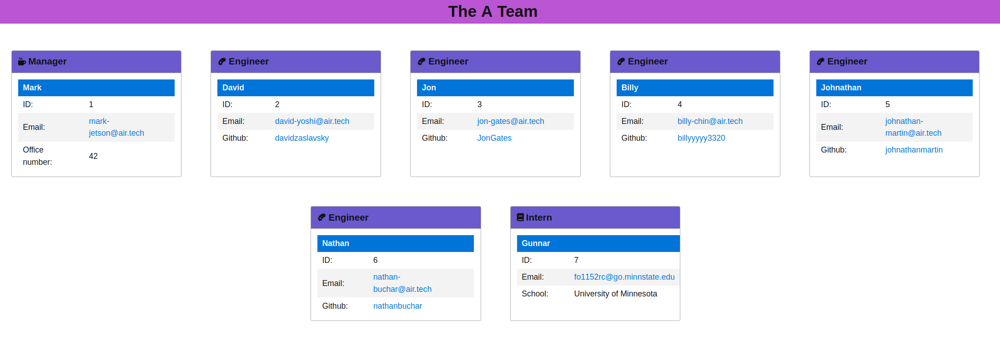

# Team Info Generator
[](https://www.gnu.org/licenses/gpl-3.0)

## Project Description
This project can help you generate a quick and easy HTML about page for your team! This was created in nodejs with jest, and inquirer.

## Table of Contents
> * [License](#license)
> * [Installation Instructions](#installation)
> * [Project Usage](#usage)
> * [Contributors](#contributors)
> * [Testing the Project](#tests)

## License
This project was licened with GPL v3. [Here's a link  to license information](https://www.gnu.org/licenses/gpl-3.0)

## Screenshot(s)


## Installation 
When installing the project, make sure to run this command:
```
npm i
```

## Usage 
The target use of this project is for users who don't want to be fuddling around with html and just want to generate a slick & quick 'about the team' HTML page.
[Here's a link to a video walkthrough, incase you have any issues using it.](https://odysee.com/@fixedOtter:f/team-info-generator:3?r=B4Y8MuDybpNxa3KDKGjAgTn6gVyNHUno)

## Contributors
Many thanks to Troy, who contributed to this project

## Tests
To test this project, please run the following:
```
npm test
```

## Questions?
Here's how you can contact me with any questions you may have!
* [Email](mailto:fo1152rc@go.minnstate.edu)
* [GitHub (fixedOtter)](https://github.com/fixedOtter)
